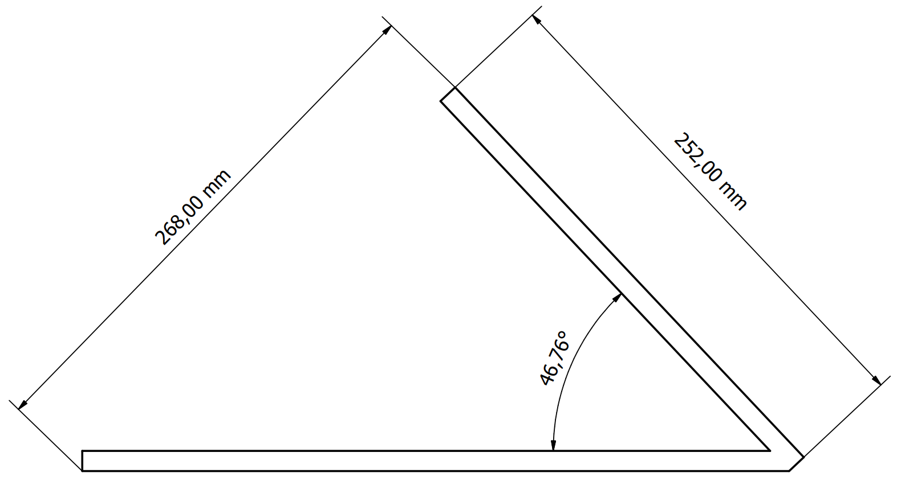
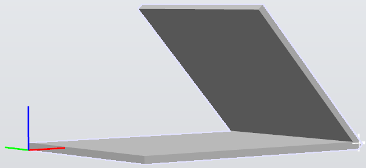
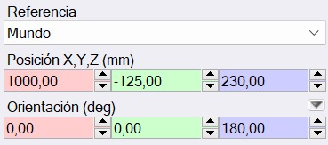
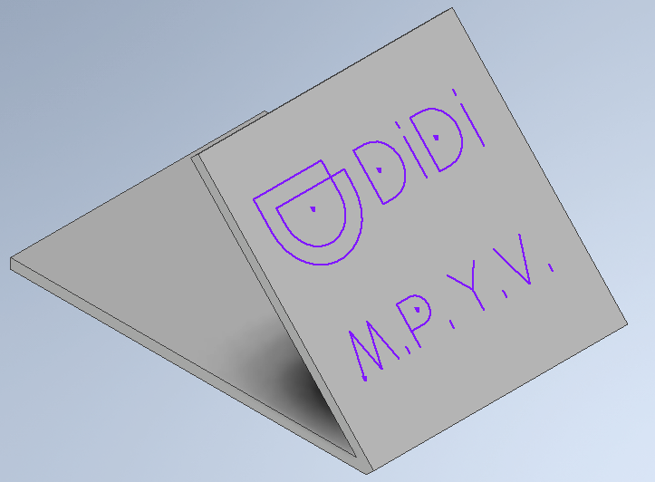
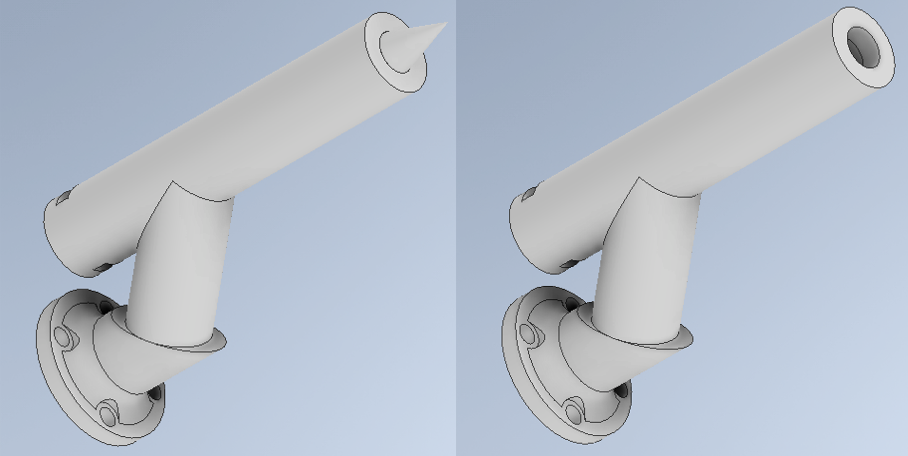
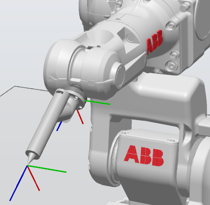
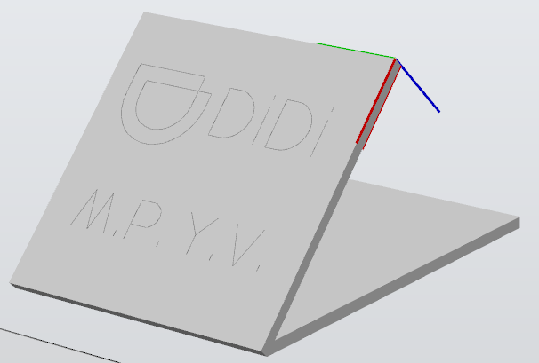
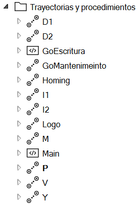

# Laboratorio 1, Robótica Industrial - Trayectorias, Entradas y Salidas Digitales
## Universidad Nacional de Colombia, 2024-I

- Maria Alejandra Peréz Petro
- Yovany Esneider Vargas Gutierrez

### 1. Descripción de la solución planteada

Se escoge la empresa de transporte DiDi, considerándola una empresa que invierte en marketing debido a sus constantes campañas de marketing en redes sociales, televisión y entretenimiento. Se plantea la escritura de su logo, seguido de las iniciales de los integrantes del Grupo M.P. y Y.V. Ver **Figura 1**.

<label for = "Fig_1" > <b>Figura 1.</b> Logo e iniciales.</label>

Donde las letras constan de un solo trazo y el logo todo su contorno. Para el desarrollo idóneo de la practica de laboratorio es necesario un análisis previo a ciertos elementos del entorno de trabajo.   

#### A. Reconocimiento y caracterización del WorkObject

En el area de trabajo existen una tablero inclinado y varias cajas de madera, partiendo del objetivo de la practica de laboratorio, este tablero es el WorkObject a trabajar, sin embargo, es necesario ubicarlo considerando el alcance del robot ABB IRB 140. Para esto es primero se han de caracterizar este par de objetos.

##### Tablero, WorkObject_1

Las dimensiones del tablero son; 25.2 cm de alto y 25 cm de ancho, su parte trasera que cumple la función de apoyo tiene un largo de 26.5 cm. Partes unidas por sus extremos en un angulo de 90°, entonces el angulo entre la base y al tablero es de 46.76° ver **Figura 2**.

<label for = "Fig_2" > <b>Figura 2.</b> Dimensiones de tablero inclinado.</label>

Ahora, se usa el ancho de la caja como soporte externo para el tablero, de medida 43 cm, ubicado desde el suelo. La distancia desde el cero de la base del robot ABB IRB 140 a la parte superior de la caja, es de 23 cm.

Con estos datos, la ubicación seleccionada para el *WorkObject_1* tomando como punto de referencia el punto inferior interno de la base del tablero ver **Figura 3** y respecto a la base del robot es; 1000 mm en X, -125 mm en Y y 230 mm en Z ver **Figura 4**.

<label for = "Fig_3" > <b>Figura 3.</b> WorkObject_1 en RobotStudio.</label>

<label for = "Fig_4" > <b>Figura 4.</b> Ubicación WorkObject_1 en RobotStudio.</label>

Así el objecto de trabajo está en condiciones optimas para el trazo de las trayectorias.

#### B. Consideraciones en el diseño de herramienta

Debido a la alta exactitud del robot ABB IRB 140 se precisa la misma exactitud en la ubicación del WorkObject, sin embargo, no se poseen las herramientas necesarias para esta tarea, por tanto es necesario un método que permita tener un rango de tolerancia. Dicho método está ubicado en la herramienta, ya que el robot no admite modificaciones. Se plantea un resorte bloqueado a traves de un pasador con un desplazamiento de 3 cm, permitiendo el desplazamiento del marcador aun si el WorkObject no esta en la posición correcta.

Bajo estás consideraciones, la metodología a desarrollar es la siguiente:

- Creación de modelos CAD

La creación del WorkObject y la herramienta se llevo a cabo con el software Autodesk Inventor, donde el logo e iniciales están descritos solo por lineas y curvas **Figura 5**. Cabe aclarar que existen 2 versiones de la herramienta, una para su representación completa en RobotStudio, que cuenta con una punta pronunciada y la segunda version para la impresión 3D ver **Figura 6**.

<label for = "Fig_5" > <b>Figura 5.</b> Logo e iniciales Autodesk Inventor.</label>

<label for = "Fig_6" > <b>Figura 6.</b> Modelado de herramienta para RobotStudio e impresión 3D Autodesk Inventor.</label>

- Montaje de herramienta y WorkObject

Desde Autodesk Inventor se exportan los modelados en formato .SAT, seguidamente se importan los modelados a RobotStudio. Desde la pestaña Modelado, sección Mecanismo, se crea la herramienta, donde una vez asignado el TCP en el modelado, la herramienta se incorpora automáticamente al robot ver **Figura 7**.

<label for = "Fig_7" > <b>Figura 7.</b> Montaje de herramienta RobotStudio.</label>

Una vez importado el modelado del tablero con el logo e iniciales en su superficie, se crea el WorkObject_1. Donde el punto asignado será la esquina superior interna del tablero ver **Figura 8**.

<label for = "Fig_8" > <b>Figura 8.</b> Creación WorkObject_1 RobotStudio.</label>

- Definición y programación de las trayectorias

Para un optimo proceso, se decide separar la trayectoria general en sub-trayectorias, asignadas al logo y las iniciales, para un total de 9 sub-trayectorias. Junto a 2 trayectorias generales extras donde se establece el Home y la posición de Mantenimiento ver **FIGURA 9**.

<label for = "Fig_9" > <b>Figura 9.</b> Trayectorias RobotStudio.</label>

Con la ayuda de las herramientas para la selección de puntos en las aristas y curvas se establecen los movimientos, para los desplazamientos a los puntos iniciales del logo e iniciales, se utiliza la instrucción MoveJ y para los trazos MoveL, en casos de circunferencias MoveC. La descripción detallada de estas funciones se encuentra en la **Sección 4**.

- Definición y programación de las entradas y salidas

Aunque en las planteamientos de la practica de laboratorio se exige un total de 2 entras y salidas, se opta por
una distribución de 3, para tener un mayor control sobre el robot, donde la DI_01 ejecuta la rutina de escritura a la vez que activa la salida DO_01, DI_02 ejecuta la rutina que lleva el robot a posición de mantenimiento de conmutando DO_02, y DI_03 ejecuta la acción de Homing ver **Figura 10**.

<label for = "Fig_10" > <b>Figura 10.</b> I/O digitales RobotStudio.</label>

De igual manera se entra en detalle en su programación en la **Sección 4**.

- Simulación

Una vez programadas las rutinas, entradas y salidas es posible ejecutar una simulación del robot, al mismo tiempo se simulan las entradas y salidas, con el fin de comprobar el correcto funcionamiento de la programación antes designada. Se lleva a cabo la simulación, esta se explora a detalle en la **Sección 7**.

- Ejecución en vivo

Una vez comprobado el correcto funcionamiento de las rutinas, entradas y salidas. Se realiza un montaje aproximado del WorkObject_1, se instala la herramienta en el robot y se carga la programación mediante USB al FlexPendant, para su posterior ejecución en vivo la evidencia en video se encuentra en la **Sección 7**.

### 2. Diagrama de flujo de acciones del robot M 

### 3. Plano de planta de la ubicación de cada uno de los elementos
Para visualizar correctamente el plano de planta, acceda a su enlace a continuación.
[Plano de planta, ubicación de cada uno de los elementos.](/Lab_1_Maria%20Pérez_Yovany%20Vargas/Plano%20de%20planta.pdf){:target="_blank"}

### 4. Descripción de las funciones utilizadas M
### 5. Diseño de herramienta

Para el diseño de la herramienta, se identifican las dimensiones de la base de la herramienta en el datasheet del robot, 
### 6. Código en RAPID del módulo utilizado para el desarrollo de la práctica M
### 7. Vídeo que contenga la simulación en _RobotStudio_ así como la implementación de la práctica con el robot real

El video se encuentra alojado en YouTube, acceder con este link: 
