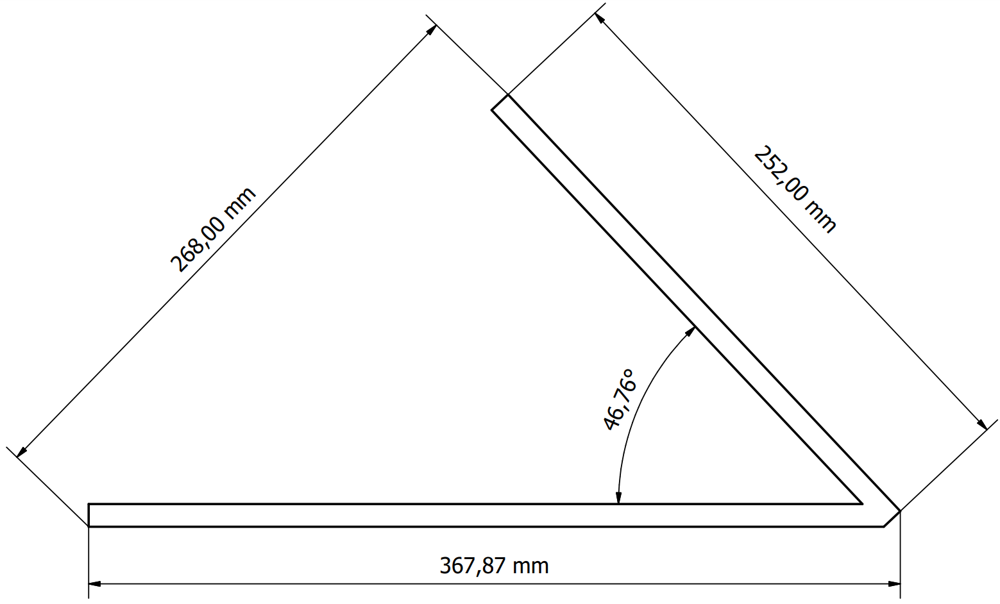

# Laboratorio 1, Robótica Industrial - Trayectorias, Entradas y Salidas Digitales
## Universidad Nacional de Colombia, 2024-I

* Maria Alejandra Peréz Petro
* Yovany Esneider Vargas Gutierrez

### 1. Descripción de la solución planteada

Se escoge como empresa de transporte DiDi, considerándola una empresa que invierte en marketing debido a sus constantes campañas de marketing en redes sociales, televisión y entretenimiento. Se plantea la escritura de su logo en primer lugar, seguido de las iniciales de los integrantes del Grupo M.P. y Y.V. Ver **Figura 1**.

<label for = "Fig_1" > <b>Figura 1.</b> Logo e iniciales.</label>

Donde las letras constan de un solo trazo y el logo todo su contorno. Para el desarrollo idóneo de la practica de laboratorio fue necesario un análisis previo al entorno de trabajo.   

#### A. Reconocimiento y caracterización del WorkObject

En el area de trabajo existen una tablero inclinado y varias cajas de madera, partiendo del objetivo de la practica de laboratorio este tablero es el WorkObject a trabajar, sin embargo, es necesario ubicar el WorkObject considerando el alcance del robot ABB IRB 140. Para esto es necesario la caracterización de estos objetos.

##### Tablero, WorkObject_1

Las dimensiones del tablero son; 25.2 cm de alto y 25 cm de ancho, su parte trasera que cumple la función de apoyo tiene un largo de 26.5 cm. Partes unidas por sus extremos en un angulo de 90°, entonces el angulo entre la base y al tablero es de 46.76° ver **Figura 2**.

 
<label for = "Fig_2" > <b>Figura 2.</b> Dimensiones de tablero inclinado.</label>

Ahora, se usa el ancho de la caja como soporte externo para el tablero, de medida 43 cm, ubicado del desde el suelo. La distancia desde el cero de la base del robot ABB IRB 140, es de 23 cm.

Con estos datos, la ubicación seleccionada para el *WorkObject_1* tomando como punto de referencia el punto inferior interno de la base del tablero ver **Figura 3** y respecto a la base del robot es; 100 cm en X, -125 cm en Y y 223 cm en Z ver **Figura 4**.

 
<label for = "Fig_3" > <b>Figura 3.</b> WorkObject_1 en Robot Studio.</label>

 
<label for = "Fig_4" > <b>Figura 4.</b> Ubicación WorkObject_1 en Robot Studio.</label>

Así el objecto de trabajo esta en condiciones optimas para el trazo de las trayectorias.

#### B. Consideraciones en el diseño de herramienta

Debido a la alta exactitud del robot ABB IRB 140, no se tienen las herramientas para ubicar el WorkObject en el punto exacto asignado, por tanto es necesario un método de tolerancia. Este método está ubicado en la herramienta, debido a que el robot no admite estas modificaciones. Se plantea un resorte bloqueado a traves de un pasador con un desplazamiento de 3 cm, permitiendo el correcto desplazamiento del marcador aun si el WorkObject no esta en la posición correcta.

Bajo estás consideraciones la metodología a desarrollar es la siguiente:

- Creación de modelos CAD
- Montaje de herramienta y WorkObject
- Definición y programación de las trayectorias
- Definición y programación de las entradas y salidas
- Simulación
- Ejecución en vivo

### 2. Diagrama de flujo de acciones del robot M 

### 3. Plano de planta de la ubicación de cada uno de los elementos Y
### 4. Descripción de las funciones utilizadas M
### 5. Diseño de herramienta Y
### 6. Código en RAPID del módulo utilizado para el desarrollo de la práctica M
### 7. Vídeo que contenga la simulación en _RobotStudio_ así como la implementación de la práctica con los robots reales Y
