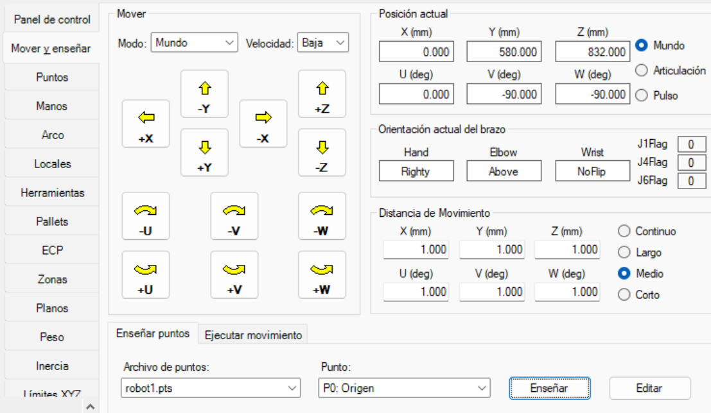

# Laboratorio 2, Epson

Robótica 2024-I

Universidad Nacional de Colombia

**INTEGRANTES**
- Maria Alejandra Peréz Petro
- Yovany Esneider Vargas Gutierrez

**TABLA DE CONTENIDO**

- [1. Especificaciones del robot utilizado](#1-Especificaciones del robot utilizado)

## 1. Especificaciones del robot utilizado

Modelo: EPSON VT6-A901S
Tipo: Seis ejes
Alcance: 920 mm
Carga útil máxima: 6 kg

El robot disponible no cuenta con modulo de entradas y salidas digitales.

<span>
<label for = "Fig_1" ><br><b>Figura 1.</b> Robot EPSON VT6-A901S.</label></span>

Por precaución la ejecución de la rutina en el robot real, se ejecuta en potencia baja. Esto plantea un delimitador en la velocidad y aceleración.

## 2. Descripción del código

Al igual que en otros robots, EPSON cuenta con un software enfocado a la programación de los mismos en este caso **EPSON RC+ 7.0** compatible con tres tipos de robots. Scara, Seis ejes y Modulos EZ ver **Figura 2**.

<span>
<label for = "Fig_2" ><br><b>Figura 1.</b> Tipos de robots, EPSON RC+ 7.0.</label></span>

En primer lugar para la correcta creación de trayectorias, se configuran los puntos. Estos se enseñan en el modulo administrador de robot, ver **Figura 3**.

<span>
<label for = "Fig_3" ><br><b>Figura 3.</b> Modulo administrador de robot.</label></span>

> [!NOTE]
> Es importante no crear directamente los puntos mediante la inserción de coordenadas, esto ocasiona un error de interpretación por parte del software. En primera instancia enseñar puntos aleatorios y luego editarlos, así se evita dicho error.

```
Global Integer i, j
Function main
	'Se definen los pallets y las salidas
	Pallet Outside, 2, Origen, EjeX, EjeY, 3, 3
	Pallet 1, Origen, EjeX, EjeY, 3, 3
	#define estado_navegar 10
	#define estado_paletizado_z 11
	#define estado_paletizado_s 12
	#define estado_paletizado_ex 13
	Motor On 'Motores On
	Power Low 'Potencia baja
	Speed 30 'Velocidad de Go, Jump y Pulse
	SpeedS 100 'Velocidad de Move, Arc...
	Accel 30, 30 '...
	AccelS 100 '...
```
> [!NOTE]
> Debido a que el robot no cuenta con modulo de entradas y salidas no es posible el control de trayectorias. Por ello se comentan las partes del código asociadas con la lectura de entras y salidas digitales.

```
	'Llamada de funciones, etc. Programación.
	Do
		'Se apagan todas las salidas para volver a empezar
		Off estado_navegar
		Off estado_paletizado_z
		Off estado_paletizado_s
		Off estado_paletizado_ex
			Home
		'If Sw(8) Then '4. Navegar
			Call navegar_2
		'ElseIf Sw(9) Then '5.
			Call paletizado_z
			Home
		'ElseIf Sw(10) Then '6.
			Call paletizado_s
			Home
		'ElseIf Sw(11) Then '8.
			Call paletizado_extremo
		'Else 'Vuelve a home
		'EndIf
	Loop
Fend

Function navegar
	'Se enciende la salida 10
	'Indicando que está en ejecución
	On estado_navegar
	'Movimientos con Go
	Go Origen
	Wait 0.5
	Go EjeX
	Wait 0.5
	Go EjeY
	Wait 0.5 'Espera 500 ms
	'Movimientos con Move
	Move Origen
	Wait 0.5
	Move EjeX
	Wait 0.5
	Move EjeY
	Wait 0.5
	'Se apaga la salida 10
	'Indicando que esta ha terminado
	Off estado_navegar
Fend
Function navegar_2
	Go Origen :Z(200)
	Go Origen
	Go Origen :Z(200)
	Wait 0.5
	Go EjeX :Z(200)
	Go EjeX
	Go EjeX :Z(200)
	Wait 0.5
	Go EjeY :Z(200)
	Go EjeY
	Go EjeY :Z(200)
	Wait 0.5
Fend

Function paletizado_z
	'Se enciende la salida 11
	'Indicando que está en ejecución
	On estado_paletizado_z
	'Mediante un For recorre todas las posiciones
	For i = 1 To 9
		Go Pallet(1, i) :Z(200)
		Go Pallet(1, i)
		Go Pallet(1, i) :Z(200)
	Next
	'Se apaga la salida 11
	'Indicando que esta ha terminado
	Off estado_paletizado_z
Fend

Function paletizado_s
	'Se enciende la salida 12
	'Indicando que está en ejecución
	On estado_paletizado_s
	For i = 1 To 3
		Go Pallet(1, i) :Z(200)
		Go Pallet(1, i)
		Go Pallet(1, i) :Z(200)
	Next
	For i = 6 To 4 Step -1
		Go Pallet(1, i) :Z(200)
		Go Pallet(1, i)
		Go Pallet(1, i) :Z(200)
	Next
	For i = 7 To 9
		Go Pallet(1, i) :Z(200)
		Go Pallet(1, i)
		Go Pallet(1, i) :Z(200)
	Next
	'Se apaga la salida 12
	'Indicando que esta ha terminado
	Off estado_paletizado_s
Fend

Function paletizado_extremo
	'Se enciende la salida 13
	'Indicando que está en ejecución
	On estado_paletizado_ex
	'Mediante dos For recorre todas las posiciones
	For i = 1 To 4
		For j = 1 To 4
			Go Pallet(2, i, j) :Z(200)
			Go Pallet(2, i, j)
			Go Pallet(2, i, j) :Z(200)
		Next
	Next
	'Se apaga la salida 13
	'Indicando que esta ha terminado
	Off estado_paletizado_ex
Fend

```
