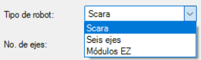

# Laboratorio 2, Epson

Robótica 2024-I

Universidad Nacional de Colombia

**INTEGRANTES**
- Maria Alejandra Peréz Petro
- Yovany Esneider Vargas Gutierrez

**TABLA DE CONTENIDO**

- [1. Especificaciones del robot utilizado](#1-especificaciones-del-robot-utilizado)
- [2. Especificaciones del robot utilizado](#2-desarrollo-de-práctica)
    - [A. Consideraciones](#a-consideraciones)
    - [B. Descripción de las funciones utilizadas](#b-descripción-de-las-funciones-utilizadas)
    - [C. Descripción detalla del código](#c-descripción-detalla-del-código)
- [3. Videos](#3-videos)
- [4. Referencias](#referencias)

## 1. Especificaciones del robot utilizado

Modelo: EPSON VT6-A901S

Tipo: Seis ejes

Alcance: 920 mm

Carga útil máxima: 6 kg

El robot disponible no cuenta con modulo de entradas y salidas digitales, ni Teach Pendant.

<span>
<label for = "Fig_1" ><br><b>Figura 1.</b> Robot EPSON VT6-A901S.</label></span>

Por precaución, la ejecución de la rutina en el robot real, se ejecuta en potencia baja. Esto plantea un delimitador en la velocidad y aceleración. También el robot tiene dos condiciones de parada de emergencia, botón de parada de emergencia y desconexión del puerto USB.

## 2. Desarrollo de práctica

### A. Consideraciones

Al igual que en otros robots, EPSON cuenta con un software enfocado a la programación de los mismos en este caso **EPSON RC+ 7.0** compatible con tres tipos de robots. Scara, Seis ejes y Módulos EZ ver **Figura 2**. El lenguaje de programación que utiliza es **SPEL+**.

<span>
<label for = "Fig_2" ><br><b>Figura 1.</b> Tipos de robots, EPSON RC+ 7.0.</label></span>

En primer lugar para la correcta creación de trayectorias, se configuran los puntos. Estos se enseñan en el modulo administrador de robot, ver **Figura 3**.

<span>
<label for = "Fig_3" ><br><b>Figura 3.</b> Modulo administrador de robot.</label></span>

> [!NOTE]
> Es importante no crear directamente los puntos mediante la inserción de coordenadas, esto ocasiona un error de interpretación por parte del software. En lugar de eso, enseñar puntos aleatorios y luego editarlos, así se evita dicho error.

Así se crean 3 tres puntos, con los cuales se desarrollan todas las trayectorias. Ver **Figura 4**.

<span>
<label for = "Fig_4" ><br><b>Figura 4.</b> Puntos.</label></span>

Finalmente se establece el punto para **HOME** este genera una trayectoria interna, que al llamarla en código, lleva el robot al **HOME** establecido, cabe resaltar que el software permite establecer el orden en que cada articulación se mueve para llegar a este punto, ver **Figura 5**.

<span>
<label for = "Fig_5" ><br><b>Figura 5.</b> Punto HOME.</label></span>

Para descargar el código creado en EPSON RC+ 7.0, se cambia la conexión del controlador virtual a USB. Ver **Figura 6**.

<span>
<label for = "Fig_6" ><br><b>Figura 6.</b> Conexión USB.</label></span>

### B. Descripción de las funciones utilizadas

- **Go:** Se utiliza para mover el robot rápidamente de un punto a otro cuando no es imprescindible que el 
movimiento siga una línea recta. Se utiliza para hacer acercamientos o alejamientos rápidos a una pieza. **Sintaxis:**  ``Go ToPoint``, también admite como entrada un pallet. Adicionalmente, permite la implementación de offsets sin modificar los puntos preestablecidos ``Go ToPoint :Axis(Offset)``.

- **Wait:** Instrucción donde el robot espera una cantidad de tiempo especificado, sus unidades son los segundos, sin embargo acepta decimales, permitiendo así la inserción de milisegundos (0.5, 500 ms). **Sintaxis:**  ``Wait Time``.

- **Move:** Instrucción que mueve el robot en línea recta desde su posición actual hasta la posición objetivo especificada. **Sintaxis:**  ``Move ToPoint``

Para la configuración de las salidas digitales se usaron los comandos **On** y **Off**, lleva la salida a 1 o 0, respectivamente.

### C. Descripción detalla del código
Como en cualquier lenguaje de programación, en primer lugar se crean todas las variable a utilizar, entre ellas se encuentran contadores, pallets y se definen las salidas digitales.

Un pallet corresponde a un area distribuida en partes iguales, donde el centro de cada una de ellas son los puntos establecidos donde el tcp llega, para su definición son necesarios 3 puntos y las dimensiones de la distribución de partes iguales. **Sintaxis:**  ``Pallet Index, Point_1, Point_2, Point_3, Rows, Columns``, existe una variación del mismo, que permite adicionar una fila y columna extra en caso de requerirlo; ``Pallet Outside Index, Point_1, Point_2, Point_3, Rows, Columns``. Ver **Figura 7**.

<span>
<label for = "Fig_7" ><br><b>Figura 7.</b> Pallet.</label></span>

Seguidamente se establecen los valores de potencia, velocidad y aceleración a los cuales el robot ha de funcionar.

```SPEL
Global Integer i, j
Function main
	'Se definen los pallets y las salidas
	Pallet Outside, 2, Origen, EjeX, EjeY, 3, 3
	Pallet 1, Origen, EjeX, EjeY, 3, 3
	#define estado_navegar 10
	#define estado_paletizado_z 11
	#define estado_paletizado_s 12
	#define estado_paletizado_ex 13
	Motor On 'Motores On
	Power Low 'Potencia baja
	Speed 30 'Velocidad de Go, Jump y Pulse
	SpeedS 100 'Velocidad de Move, Arc, entre otros
	Accel 30, 30 'Aceleración de Go, Jump y Pulse
	AccelS 100 'Aceleración de Move, Arc, entre otros
```

> [!NOTE]
> Debido a que el robot no cuenta con modulo de entradas y salidas no es posible el control de trayectorias. Por ello se comentan las partes del código asociadas con la lectura de entras, ubicadas en los comandos ``If Sw(Input)``.

La rutina de **main** consiste en ir a **HOME**, seguidamente llamar la trayectoria ``navegar``, ``paletizado_z``, ``paletizado_s`` y ``paletizado_externo``, volviendo a **HOME** entre trayectorias.

```SPEL+
	'Llamada de funciones, etc. Programación.
	'Do
		'Se apagan todas las salidas para volver a empezar
		Off estado_navegar
		Off estado_paletizado_z
		Off estado_paletizado_s
		Off estado_paletizado_ex
			Home
		'If Sw(8) Then '4. Navegar
			Call navegar
		'ElseIf Sw(9) Then '5.
			Call paletizado_z
			Home
		'ElseIf Sw(10) Then '6.
			Call paletizado_s
			Home
		'ElseIf Sw(11) Then '8.
			Call paletizado_externo
		'Else 'Vuelve a home
		'EndIf
	'Loop
Fend
```

La trayectoria ``navegar`` corresponde a la función con su mismo nombre, la cual hace el recorrido por los tres puntos creados con anterioridad, como se vio en la sección de [consideraciones](#a-consideraciones). Se hace el recorrido en primer lugar con la función **Go**, y luego **Move**. Esperando 500 ms entre cada movimiento.

```SPEL+
Function navegar
	'Se enciende la salida 10
	'Indicando que está en ejecución
	On estado_navegar
	'Movimientos con Go
	Go Origen
	Wait 0.5 'Espera 500 ms
	Go EjeX
	Wait 0.5
	Go EjeY
	Wait 0.5
	'Movimientos con Move
	Move Origen
	Wait 0.5
	Move EjeX
	Wait 0.5
	Move EjeY
	Wait 0.5
	'Se apaga la salida 10
	'Indicando que esta ha terminado
	Off estado_navegar
Fend
```

La trayectoria ``paletizado_z``, hace el recorrido con la función **Go** del pallet de dimensiones 3x3 creado en las primeras lineas di código. Este recorrido se logra mediante un ``for`` que permite el recorrido secuencial de cada una de las nueve ubicaciones en el pallet.

```SPEL+
Function paletizado_z
	'Se enciende la salida 11
	'Indicando que está en ejecución
	On estado_paletizado_z
	'Mediante un For recorre todas las posiciones
	For i = 1 To 9
		Go Pallet(1, i) :Z(200)
		Go Pallet(1, i)
		Go Pallet(1, i) :Z(200)
	Next
	'Se apaga la salida 11
	'Indicando que esta ha terminado
	Off estado_paletizado_z
Fend
```

La trayectoria ``paletizado_s``, hace el recorrido con la función **Go** del pallet en S. Este recorrido se logra alternando entre un paso positivo y negativo, ya que la segunda fila debe recorrerse en dirección contraria para el recorrido en S.

```SPEL+
Function paletizado_s
	'Se enciende la salida 12
	'Indicando que está en ejecución
	On estado_paletizado_s
	For i = 1 To 3
		Go Pallet(1, i) :Z(200)
		Go Pallet(1, i)
		Go Pallet(1, i) :Z(200)
	Next
	For i = 6 To 4 Step -1
		Go Pallet(1, i) :Z(200)
		Go Pallet(1, i)
		Go Pallet(1, i) :Z(200)
	Next
	For i = 7 To 9
		Go Pallet(1, i) :Z(200)
		Go Pallet(1, i)
		Go Pallet(1, i) :Z(200)
	Next
	'Se apaga la salida 12
	'Indicando que esta ha terminado
	Off estado_paletizado_s
Fend
```

La trayectoria ``paletizado_externo``, hace el recorrido con la función **Go** del pallet outside. En este caso se recorre mediante dos ciclos ``for``. Este método también es posible en un pallet normal.

```SPEL+
Function paletizado_externo
	'Se enciende la salida 13
	'Indicando que está en ejecución
	On estado_paletizado_ex
	'Mediante dos For recorre todas las posiciones
	For i = 1 To 4
		For j = 1 To 4
			Go Pallet(2, i, j) :Z(200)
			Go Pallet(2, i, j)
			Go Pallet(2, i, j) :Z(200)
		Next
	Next
	'Se apaga la salida 13
	'Indicando que esta ha terminado
	Off estado_paletizado_ex
Fend
```

El código completo se encuentra en el archivo [Main.prg](./Main.prg).

## 3. Videos

Los videos están almacenados en una carpeta de drive con acceso general [Link](https://drive.google.com/drive/folders/1T4iOJfjbF1U0leWlQVlbVVba-X9EQseo?usp=drive_link). Hay un total de 3 videos.

[1. Ejecución del código del programa de Maria Peréz](https://drive.google.com/file/d/1h_bwgz-KlUIUS3DazlSsES4aIiHJqVMX/view?usp=drive_link)

[2. Ejecución del código del programa de Yovany Vargas](https://drive.google.com/file/d/1kXkxF5EArWzg4wBgNJhnc32K4FhgaQRT/view?usp=drive_link)

[3. Vista del software EPSON RC+ 7.0 con el robot en ejecución](https://drive.google.com/file/d/1mAecAb9SD7CPf3xmbNIcIN6Cff_7Qffc/view?usp=drive_link)

En este ultimo se evidencia el seguimiento de los movimientos del robot en EPSON RC+ 7.0, esto se logra mediante la conexión USB, presente al momento de descargar el código en el controlador del robot.

## Referencias

[1] Control De Movimiento, Control De Movimiento, _CAPACITACIÓN BÁSICA EPSON RC+ 7.0 - ROBOTS SCARA SERIE T_. Recuperado de: [micampus.unal.edu.co](https://micampus.unal.edu.co/pluginfile.php/2688481/mod_assign/introattachment/0/Capacitacio%CC%81n%20ba%CC%81sica%20EPSON%20RC%20%2B%207.0%20SCARA%20SERIE%20T%20131023.pdf?forcedownload=1).