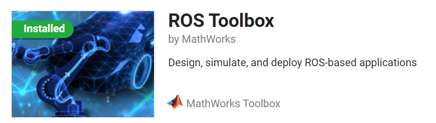

# Laboratorio 3, Intro a ROS <!-- omit from toc -->

Robótica 2024-I

Universidad Nacional de Colombia

**INTEGRANTES**
- Maria Alejandra Peréz Petro
- Yovany Esneider Vargas Gutierrez

**TABLA DE CONTENIDO**
- [1. Conexión Matlab con ROS](#1-conexión-Matlab-con-ROS)
- [Conclusiones](#Conclusiones)

## 1. Conexión Matlab con ROS

Se inician 2 instancias de terminal, en la primera se llama al nodo maestro con el comando `roscore`.

<span>
<label for = "Fig_1" ><br><b>Figura 1.</b>  Llamada de nodo maestro.</label></span>

En la segunda el comando `rosrun turtlesim turtlesim node`, este inicializa el programa de la tortuga.

<span>
<label for = "Fig_2" ><br><b>Figura 2.</b>  Ejecución tortuga.</label></span>

Script en MatLab, este se conecta con ROS y permite asignar valores a la posición de la tortuga.
```
rosinit;

velPub = rospublisher('/turtle1/cmd_vel','geometry_msgs/Twist');
velMsg = rosmessage(velPub)

velMsg.Linear.X = 2 
velMsg.Linear.Y = 3
send(velPub,velMsg)
pause(1)
```
Donde la primera sección inicia el nodo maestro, seguidamente se inicializan las variables, se modifican sus atributos y se envía para su posterior visualización ver **Figura 3**.

<span>
<label for = "Fig_3" ><br><b>Figura 3.</b> Conexión MatLab con ROS.</label></span>

Para la obtención del ultimo mensaje se deja la obtención del mensaje sin punto y coma de manera que imprima en consola y se visualice la información.

```
rosmessage(posPub); % -----> rosmessage(posPub)
```
Se observa para la primera conexión en la **Figura 4** y para la ultima en la **Figura 5**.

<span>
<label for = "Fig_4" ><br><b>Figura 4.</b> Obtención del ultimo mensaje, primera conexión.</label></span>

<span>
<label for = "Fig_5" ><br><b>Figura 5.</b> Obtención del ultimo mensaje, ultima conexión.</label></span>

Con el paso anterior se obtienen todos los atributos que tiene el objeto tortuga, por tanto el ultimo script que permite enviar todos los valores asociados a la pose de la tortuga, debe tener lineas de código donde se cambie cada uno de estos atributos, y finalmente se envíen para su ejecución.

Los atributos de la tortuga son, posición en **_X_** y **_Y_**, angulo de inclinación en radianes, velocidad linear y angular.
Finalmente se detiene la conexión con el nodo maestro con el comando `rosshutdown`.

<span>
<label for = "Fig_6" ><br><b>Figura 6.</b> Desconexión del nodo maestro.</label></span>


## Conclusiones

* MatLab es un software con un amplio desarrollo en diferentes areas de estudio, si bien no fue necesario la llamada de funciones de un nivel de complejidad más alta. Siendo así que cuenta con un toolbox para ROS, que permite la conexión directa con el nodo maestro.

<span>
<label for = "Fig_7" ><br><b>Figura 7.</b> ROS Toolbox.</label></span>

* Cabe resaltan que el proceso de pre-desarrollo tiene un mayor grado de complejidad que la practica en si, ya que se somete al practicante a nuevos entornos, sistemas operativos. Con los cuales no está familiarizado, generando una retroalimentación constante sobre sus errores y aciertos.