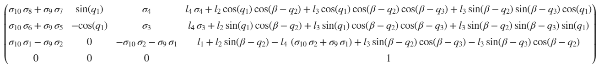
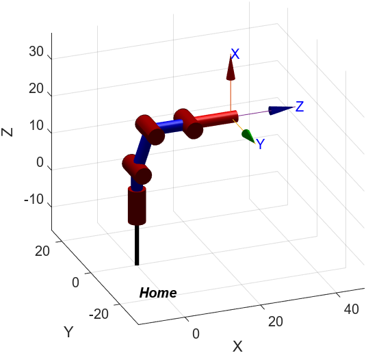
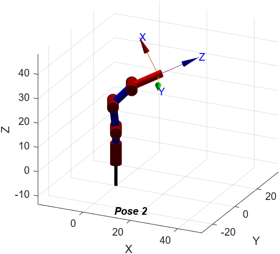
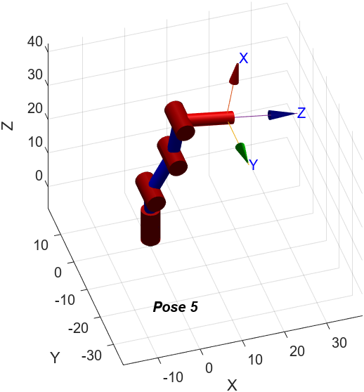

# Laboratorio 4, Cinemática Directa - Phantom X - ROS <!-- omit from toc -->

Robótica 2024-I     

Universidad Nacional de Colombia

**INTEGRANTES**
- Maria Alejandra Peréz Petro
- Yovany Esneider Vargas Gutierrez

**TABLA DE CONTENIDO**
- [1. Configuración del espacio de trabajo](#1-configuración-del-espacio-de-trabajo)
  - [Recomendaciones iniciales.](#recomendaciones-iniciales)
  - [a. Descarga de Dynamixel](#a-descarga-de-dynamixel)
  - [b. Configuración de *dynamixel\_one\_motor*](#b-configuración-de-dynamixel_one_motor)
- [2. Extracción de parámetros de Denavit-Hartenberg Estándar (DHstd)](#2-extracción-de-parámetros-de-denavit-hartenberg-estándar-dhstd)
- [3. Conexión con Python](#3-conexión-con-python)
- [4. Interfaz gráfica](#4-interfaz-gráfica)
- [5. Video de demostración](#5-video-de-demostración)
- [6. Comparación Gráficas Digitales vs Gráficas Reales](#6-comparación-gráficas-digitales-vs-gráficas-reales)
- [Referencias](#referencias)

# 1. Configuración del espacio de trabajo

Aunque el enfoque de la práctica es el uso de herramientas, como el toolbox de Peter Corke y ROS, buena parte del tiempo es invertida en explorar la documentación y los repositorios de referencia. Por tanto, a continuación se expone el procedimiento a seguir para configurar el espacio de trabajo previo a la elaboración de la práctica, con el fin de que el sistema reconozca los motores y sea posible la conexión con ROS.

## Recomendaciones iniciales.

 - No es necesario y llega a ser perjudicial actualizar Python. Con la version de Python que trae la version 20.04 LTS de Ubuntu es más que suficiente.

 - No es necesario eliminar los repositorios antes utilizados en la herramienta `Catkin`, no existe evidencia alguna que determine si esto afecta el funcionamiento de la conexión de los motores con ROS.

 - Se debe conectar el robot a la fuente de alimentación y el cable de datos a la computadora, en caso contrario, tanto ROS como el software de Dynamixel NO detectaran los motores por más comandos de configuración que se ejecuten.

## a. Descarga de Dynamixel

Primero, descargue el paquete de instalación para Ubuntu (linux) <a href= https://emanual.robotis.com/docs/en/software/dynamixel/dynamixel_wizard2/>(aquí)</a>. Luego, abra la terminal en la carpeta donde se ubica el paquete descargado y ejecute los siguientes comandos en el orden dado.

- Otorgar permisos al paquete en cuestión.

```
sudo chmod 775 DynamixelWizard2Setup_x64
```

- Iniciar el programa y finalizar la instalación.

```
./DynamixelWizard2Setup_x64
```

- Dar acceso a los puertos USB.

```
sudo usermod -aG dialout UserName
```

*UserName*, corresponde al nombre de usuario de su cuenta Linux, con la que se inicia sesión en Ubuntu.

- Reiniciar

```
reboot
```

Una vez terminado el proceso anterior, Ubuntu esta configurado para permitir el paso de información por parte de los motores. Así el software de Dynamixel puede identificar los motores a la hora de ejecutar el Scan encargado de su búsqueda, sin embargo ROS aún no los reconoce.

## b. Configuración de *dynamixel_one_motor*

Se asume que el usuario tiene a su disposición `ROS` y la herramienta `Catkin`. 

1. Se crea un directorio (carpeta) llamado `catkin_ws`, el cual servirá como espacio de trabajo para el proyecto ROS. Luego, se crea la carpeta `src`y se compila todo el código dentro del espacio de trabajo con el comando `catkin build`.
```
cd ~
mkdir catkin_ws
cd catkin_ws
mkdir src
catkin build
```
2. Se clona el repositorio [dynamixel_one_motor](https://github.com/fegonzalez7/dynamixel_one_motor.git) dentro de la carpeta src del espacio de trabajo creado.

```
git clone https://github.com/fegonzalez7/dynamixel_one_motor.git
```

3. Editar el archivo `basic.yaml`, ubicado en la carpeta `config`, en la ruta `...\catkin_ws\src\dynamixel_one_motor\config\`. Allí se debe dejar la siguiente configuración de los ID de cada uno de los motores y guardar los cambios.

```
joint_1:
  ID: 1
  Return_Delay_Time: 0
  
joint_2:
 ID: 2
 Return_Delay_Time: 1
  
joint_3:
 ID: 3
 Return_Delay_Time: 2
  
joint_4:
 ID: 4
 Return_Delay_Time: 3
  
joint_5:
 ID: 5
 Return_Delay_Time: 4
 ```

 Como se puede observar `Return_Delay_Time`, es la característica encargada del retardo por articulación recomendado en la guía de trabajo. 
 
 4. Con una terminal abierta en la carpeta `catkin_ws`, ejecute los siguientes comandos para guardar los cambios.

 ```
catkin build dynamixel_one_motor
source devel/setup.bash
 ```

5. Con la terminal abierta en la carpeta `catkin_ws`, ejecute el siguiente comando, el cual da pie a la ejecución y conexión de ROS con los motores.

 ```
 
 roslaunch dynamixel_one_motor one_controller.launch
```

Si las recomendaciones y pasos anteriores, fueron correctamente ejecutados el resultado debe ser el siguiente. Ver **Figura 1.**, allí se evidencia como ROS reconoce los 5 motores del robot.

<span>
<label for = "Fig_1" ><br><b>Figura 1.</b> ROS Corriendo correctamente.</label></span>

# 2. Extracción de parámetros de Denavit-Hartenberg Estándar (DHstd)

En primer lugar se considero a la base como primera articulación, ahorrando un eje en el proceso, la quinta articulación corresponde a la herramienta `tool`. Siguiendo los 7 pasos para la extracción de los parámetros DH, el diagrama resultante que representa al robot *Phantom X* es el siguiente. Ver **Figura 2**.

<span> 
<label for = "Fig_2" ><br><b>Figura 2.</b> Análisis DHstd.</label></span>

Los parámetros DHstd resultantes, se encuentran en la **Tabla 1**, donde el ángulo entre $X_1$ y $X_2$, es igual en magnitud al ángulo entre $X_2$ y $X_3$, pero en sentido contrario, con valor 71.138° es decir 1.242 rad.

| $i$ | $\theta_i$ | $d_i$ $(cm)$ | $a_i$ $(cm)$ | $\alpha_i$ $(rad)$| $offset$ $(rad)$|
|-|-|-|-|-|-|
| 1 | $q_1$  | 9.7  | 0 | $\pi/2$ | 0 |
| 2 | $-q_2$  | 0  | 10.67 | 0 | 1.242 |
| 3 | $q_3$  | 0  | 10.135 | 0 | -1.242 |
| 4 | $-q_4$  | 0  | 0 | $\pi/2$ | $\pi/2$ |
| 5 | 0 | 11.19 | 0 | 0 | 0 |

<label for = "Tab_2" ><br><b>Tabla 1.</b> Parámetros DHstd.</label></span>

Seguidamente entra en juego el uso del toolbox de Peter Corke, para la obtención de las matrices de transformación homogénea, para ello se creo una función la cual recibe un arreglo con los parámetros antes obtenidos, arreglo el cual corresponde a la articulación en cuestión. Esta función retorna la matriz correspondiente, para una mejor comprensión se utilizo al extension `Symbolic Math Toolbox`, la cual permite operar con símbolos, dando una perspectiva parametrizada en las matrices.

```
function [H] = MTH(rowDH)
    theta = rowDH(1);
    d = rowDH(2);
    a = rowDH(3);
    alpha = rowDH(4);
    offset = rowDH(5);
    H = trotz(theta + offset)*transl(0,0,d)*transl(a,0,0)*trotx(alpha);
end
```
Se obtienen las matrices individuales T01 a T45, ver **Figuras 3, 4, 5, 6 y 7**.

<span>
<label for = "Fig_3" ><br><b>Figura 3.</b> Matriz T01.</label></span>

<span>
<label for = "Fig_4" ><br><b>Figura 4.</b> Matriz T12.</label></span>

<span>
<label for = "Fig_5" ><br><b>Figura 5.</b> Matriz T23.</label></span>

<span>
<label for = "Fig_6" ><br><b>Figura 6.</b> Matriz T34.</label></span>

<span>
<label for = "Fig_7" ><br><b>Figura 7.</b> Matriz T45.</label></span>

Para obtener la matriz T05, es decir la herramienta `tool` respecto a la base, se multiplican todas las anteriores `T05 = T01*T12*T23*T34*T45`. Ver **Figura 8**.

<span>
<label for = "Fig_8" ><br><b>Figura 8.</b> Matriz T05.</label></span>

<span>
<label for = "Fig_9" ><br><b>Figura 9.</b> Variables de la matriz T05.</label></span>

# 3. Conexión con Python

# 4. Interfaz gráfica

# 5. Video de demostración

Se optó por hacer un video donde se vean ambos requerimientos, la demostración de uso de la interfaz de usuario y el brazo alcanzando cada posición solicitada. Dicho video se encuentra en Google Drive, se puede acceder a el mediante este <a href=https://drive.google.com/file/d/1fMCtE7DXn7XliofkItHqumCnGdevGWHD/view?usp/>link</a>, es importante que acceda con la cuenta institucional *(ejemplo@unal.edu.co)*.

Allí se observa el correcto funcionamiento de la interfaz y al robot alcanzando las 5 posiciones solicitadas.

# 6. Comparación Gráficas Digitales vs Gráficas Reales

Para la obtención de los gráficos para cada posición, se hizo uso de la función `SerialLink()` del toolbox de Peter Corke, que solicita los parametros Denavit-Hartenberg ya vinculados a las conexiones, para ello se usa la función `Link()` que recibe 6 parámetros.

```matlab
Link($/theta_i$, $d_i$, $a_i$, $/alpha_i$, $Type$, $Offset$)
```

Siendo $Type$ el tipo de articulación, donde 0 es cilíndrica y 1 prismática. En este caso el Phantom X, solo posee articulaciones cilíndricas. Para la herramienta como se recomienda en la guía, se utiliza el comando `phantomX.tool()`, desde el cual se define una traslación en el eje approach de la distancia correspondiente entre los ejes $X_4$ y $n$. Se asignan los nombres y finalmente con el comando `phantomX.plot(q)` se obtienen las gráficas. Ver **Figuras x, x, x, x y x**.

```matlab
%Poses
q1 = [0, 0, 0, 0];
q2 = [25, 25, 20, -20];
q3 = [-35, 35, -30, 30];
q4 = [85, -20, 55, 25];
q5 = [0, -10, 90, 90];
poses = [q1; q2; q3; q4; q5];

names = ["Home", "Pose 2", "Pose 3", "Pose 4", "Pose 5"];
beta = deg2rad(71.138);
DHparameters = [[0 9.7 0 pi/2 0 0];
                [0 0 10.67 0 0 beta];
                [0 0 10.135 0 0 -beta];
                [0 0 0 pi/2 0 pi/2];
                [0 11.19 0 0 0 0]];
%Generar las ilustraciones
for i = 1:length(poses)
    q = poses(i, :)*pi/180
    L(1) = Link(DHparameters(1,:));
    L(2) = Link(DHparameters(2,:));
    L(3) = Link(DHparameters(3,:));
    L(4) = Link(DHparameters(4,:));
    phantomX = SerialLink(L);
    phantomX.tool = trotx(0) * transl(0, 0, 11.19)
    phantomX.name = names(i);
    figure()
    phantomX.plot(q);
    view([-22.3 7.9])
    zlim([-30 45])
end
```

<span>
<label for = "Fig_x" ><br><b>Figura x.</b> Pose 1, Home.</label></span>

<span>
<label for = "Fig_x" ><br><b>Figura x.</b> Pose 2.</label></span>

<span>
<label for = "Fig_x" ><br><b>Figura x.</b> Pose 3.</label></span>

<span>
<label for = "Fig_x" ><br><b>Figura x.</b> Pose 4.</label></span>

<span>
<label for = "Fig_x" ><br><b>Figura x.</b> Pose 5.</label></span>

Una vez solicitadas las poses en el robot, los resultados reales respecto a estas gráficas son los siguientes.

<span>
<label for = "Fig_x" ><br><b>Figura x.</b> Comparación pose 1, Home.</label></span>

<span>
<label for = "Fig_x" ><br><b>Figura x.</b> Comparación pose 2.</label></span>

<span>
<label for = "Fig_x" ><br><b>Figura x.</b> Comparación pose 3.</label></span>

<span>
<label for = "Fig_x" ><br><b>Figura x.</b> Comparación pose 4.</label></span>

<span>
<label for = "Fig_x" ><br><b>Figura x.</b> Comparación pose 5.</label></span>

Se observa una similitud adecuada, aunque el eslabón representado en la gráfica entre las articulaciones 2 y 3 es la linea recta entre ambos puntos, es claro identificar que gráfica corresponde a cada pose. Es decir, la similitud esperada por parte del Phantom X.

# Referencias
[1] Joint controller. https://wiki.ros.org/dynamixel_controllers/Tutorials/CreatingJointPositionController

[2] Paquetes de Dynamixel Workbench. [Repositorio en GitHub]. https://github.com/fegonzalez7/rob_unal_clase3

[3] Paquete del robot Phantom X. [Repositorio en GitHub]. https://github.com/felipeg17/px_robot

[4] Tutorial Phantom X Robot. [Repositorio en GitHub]. https://github.cPhantom X Robotom/fegonzalez7/rob_unal_clase4

Repo de referencia 1
https://github.com/sofiaponteb/Labs-Robotica-2022-2/blob/main/Lab4.md

Repo de referencia 2
https://github.com/aholguinr/Lab4_Robotica_Caipa_Holguin
